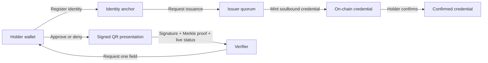

# VeriBind

### Wallet-bound credentials. Selective proof. No unnecessary disclosure.

VeriBind is a credential verification demo built around a simple trust rule:
the holder controls the credential, the institution issues it, and the
verifier receives only the fact they asked for.

The project combines a Solidity credential contract with a React interface,
Merkle proofs, wallet signatures, and QR presentations.

> **Demo status**
> The UI currently runs with fixture data and local state. The contract and
> live verification paths are prepared for a configured network, but a public
> deployment is not included by default.

## The trust flow



### What is proven

| Layer | Purpose |
| --- | --- |
| Wallet | Binds identity, consent, and presentation signing to an address |
| Issuer quorum | Requires the configured approval threshold before minting |
| Credential contract | Stores recipient, lifecycle status, issuance digest, and Merkle root |
| Merkle proof | Proves one selected field without exposing the full certificate |
| QR presentation | Carries the selected claim, proof, nonce, and holder signature |

## Features

- Wallet-based role routing for holders, issuers, and verifiers
- Holder identity registration with a document hash anchor
- Multi-approval institutional issuance
- Soulbound credential lifecycle: pending, confirmed, or disputed
- Holder-controlled share or deny decisions
- Field-level Merkle proofs for minimal disclosure
- MetaMask-signed QR presentations
- QR image import and payload validation
- Light and dark themes with responsive mobile layouts
- Developer flow debugger with runtime hashes, addresses, IDs, and state

## Quick start

### Requirements

- Node.js 18 or newer
- npm
- MetaMask for real wallet signing

Install dependencies from the project root:

```powershell
npm install
npm --prefix frontend install
```

Compile and test the contract:

```powershell
npm run compile
npm test
```

Start the frontend:

```powershell
npm run frontend
```

Open the URL printed by Vite, usually `http://127.0.0.1:5173/`.

For a production frontend build:

```powershell
npm run build
```

## Using the demo

1. Connect MetaMask or choose a local fixture wallet.
2. Register the holder identity.
3. Use the issuer workspace to reach the approval threshold and mint.
4. Return to the holder workspace and confirm the credential.
5. Ask for one field from the verifier workspace.
6. Open **Present**, connect the holder MetaMask account, and sign the QR.
7. Import the QR in **Verify** to inspect the validation result.

The QR requires the holder wallet because it contains a cryptographic signature.
Creating a QR image alone would be easy, but it would not prove that the
credential holder approved the disclosure.

## Environment configuration

Copy the example file before configuring a live network:

```powershell
Copy-Item .env.example .env
```

Set these values when using deployed-chain verification:

```dotenv
VITE_OFFICIAL_CHAIN_ID=11155111
VITE_VERIBIND_CONTRACT_ADDRESS=0xYourDeployedContract
VITE_DEMO_RECIPIENT_ADDRESS=0xCredentialRecipient
```

Deployment-only values such as `SEPOLIA_RPC_URL`, `DEPLOYER_PRIVATE_KEY`, and
`PINATA_JWT` belong in `.env` and must never be committed.

## Python environment

The application itself uses Node.js, Hardhat, and Vite. A project-local Python
environment is included for future scripts or tooling; it currently has no
required packages.

```powershell
.\.venv\Scripts\Activate.ps1
python --version
python -c "import sys; print(sys.executable)"
deactivate
```

## Project map

```text
contracts/                 Solidity credential contract
deployment/                Deployment manifest examples
fixtures(only demo data)/  Synthetic demo data
frontend/src/              React application and verification utilities
scripts/                   Hardhat deployment scripts
test/                      Contract tests
```

Important frontend modules:

- `frontend/src/App.tsx` - wallet flow, role views, QR generation, and UI state
- `frontend/src/lib/merkle.ts` - field hashing, roots, and proof verification
- `frontend/src/lib/presentation.ts` - signed presentation schema and checks
- `frontend/src/styles.css` - responsive theme and application styling

## Safety boundaries

- Never place private keys, AES keys, or production secrets in fixture files.
- Treat a QR as untrusted input until its signature, proof, contract, network,
  recipient, and credential status all pass validation.
- Keep `.env` local. Only `.env.example` belongs in source control.

## License

This repository is a private demonstration project.
